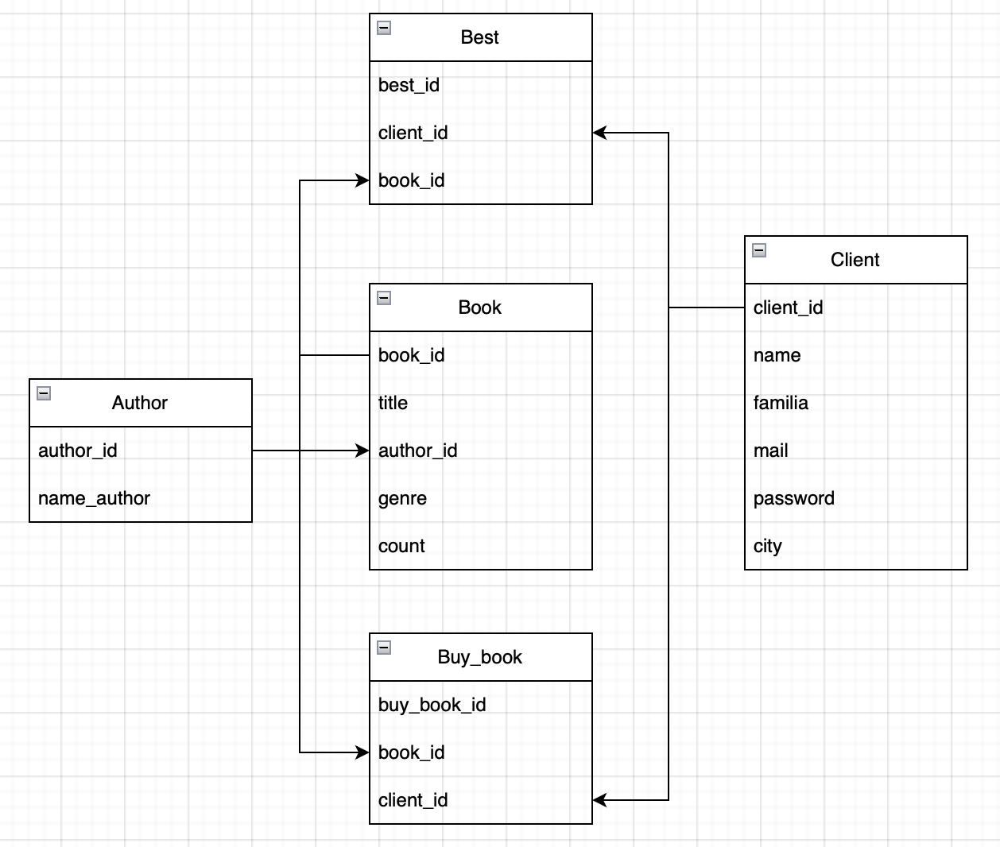
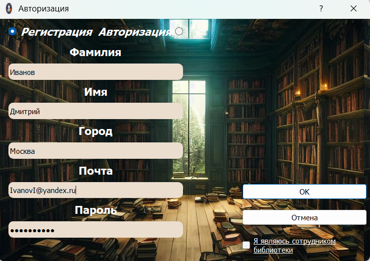
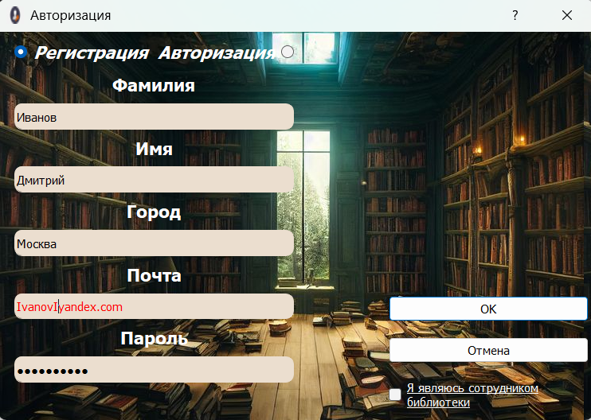
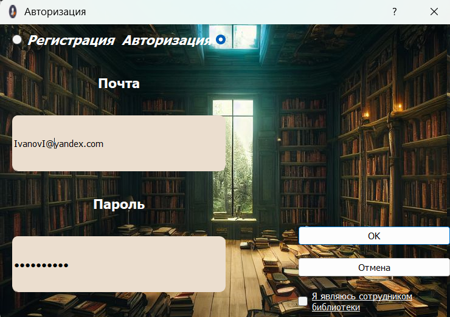
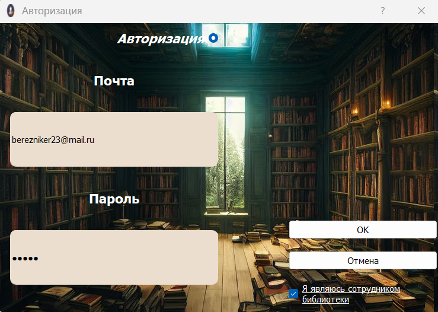
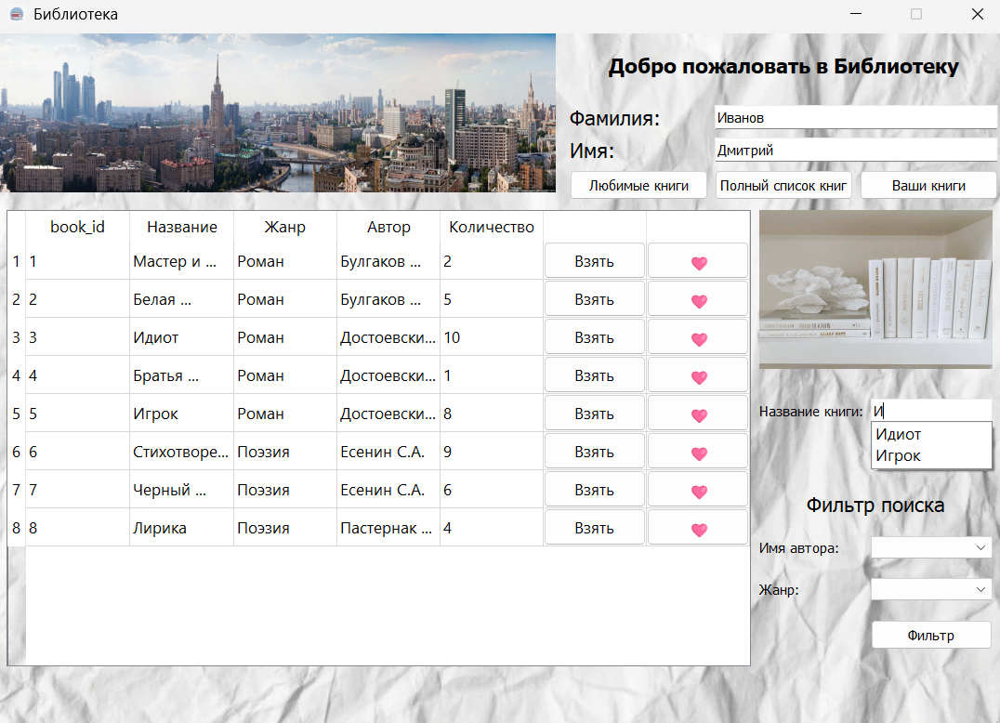

# Desktop приложение для библиотеки

## 📊 Визуализация базы данных

## 🔗 Функционал авторизации/регистрации в библиотеку:
- Два уровня доступа в библиотеку:
  - Пользователь;
  - Сотрудник библиотеки.
- Хэширование паролей (QCryptographicHash);
- Валидация почты (QRegularExpressionValidator);

Если допустить ошибку в почте, то она будет выделяться красным. 

## 🔗 Основная часть приложения:

- Для пользователя:
  - Показать все книги;
  - Показать список любимых книг;
  - Показать спиос взятых книг;
  - Поиск книги по названию с функцией подсказок (QCompleter);
  - Фильтр поиска по жанру и/или имени автора;
  - Возможность "взять", "лайкнуть" книгу.

- Для администратора:
  - Показать все книги;
  - Показать список пользователей
  - Блокировка пользователей с функцией изъятия книги;
  - Показать список ВСЕХ взятых книг и кем они были взяты;
  - Поиск книги по названию с функцией подсказок (QCompleter);
  - Фильтр поиска по жанру и/или имени автора;

